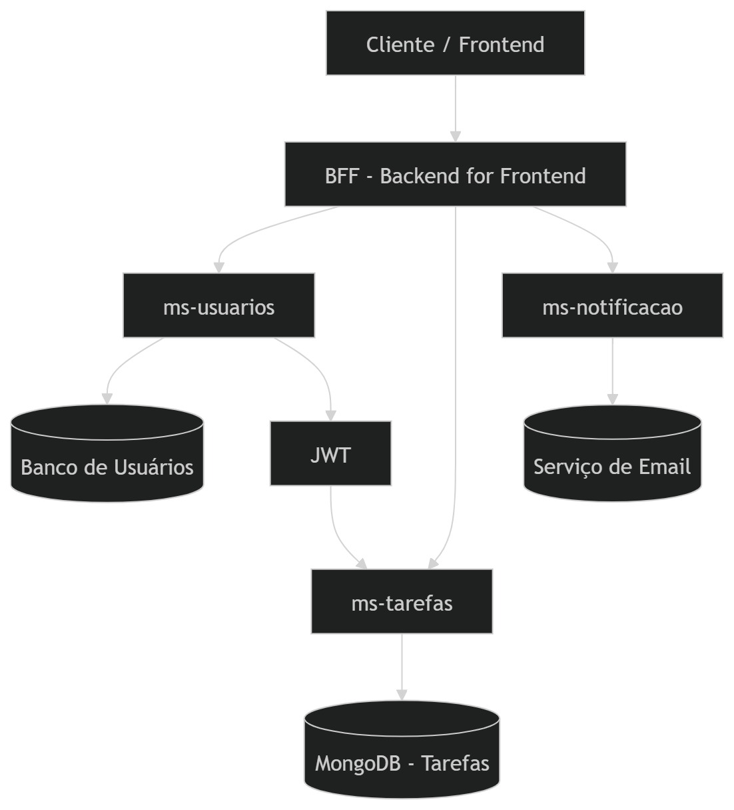

# Microserviço de Tarefas (ms-tarefas)

---

### Contexto do Projeto

O **ms-tarefas** é uma API REST desenvolvida em **Java com Spring Boot** e faz parte do projeto **Agendador de Tarefas**, construído com base em arquitetura de microserviços.

Este microserviço é responsável pelo gerenciamento das tarefas dos usuários, permitindo a criação, atualização, exclusão e controle de status.

Ele atua como serviço de domínio da aplicação, concentrando exclusivamente as regras de negócio relacionadas às tarefas.

O microserviço está **dockerizado**, permitindo execução isolada, portabilidade e integração rápida com o ecossistema de microserviços.

---

**Arquitetura do Sistema**

O sistema Agendador de Tarefas é composto por múltiplos microserviços especializados que trabalham de forma independente.

O **ms-tarefas** é responsável pelo gerenciamento das tarefas dos usuários e se integra com outros serviços da arquitetura.

**Diagrama da Arquitetura**

**Descrição do fluxo**

1. O cliente realiza autenticação através do ms-usuarios.

2. O ms-usuarios gera um token JWT.

3. O cliente envia requisições autenticadas para o BFF.

4. O BFF encaminha as requisições para o ms-tarefas.

5. O ms-tarefas valida o token JWT antes de processar a requisição.

6. As tarefas são persistidas no MongoDB.

7. O ms-notificacao é acionado para envio de notificações.

**Essa arquitetura garante:**

- Separação clara de responsabilidades

- Segurança centralizada

- Escalabilidade independente

- Organização modular da aplicação

---

### Papel na Arquitetura de Microserviços

Na arquitetura do Agendador de Tarefas, cada microserviço possui responsabilidade única e bem definida.

O **ms-tarefas** é responsável por:

- Cadastro e manutenção de tarefas

- Atualização de status

- Persistência de dados no MongoDB

- Validação de autenticação via JWT

- Exposição de métricas e monitoramento da aplicação

- Integração entre microsserviços via OpenFeign

A autenticação é centralizada no **ms-usuarios**. O **ms-tarefas** valida o token JWT antes de processar qualquer requisição protegida.

Além disso, a comunicação entre microserviços é realizada utilizando **Spring Cloud OpenFeign**, permitindo chamadas HTTP declarativas e desacopladas.

---

API REST

O **ms-tarefas** expõe endpoints REST **stateless** utilizando:

- Métodos HTTP (GET, POST, PUT, DELETE)

- Representação de recursos em formato JSON

- Comunicação via HTTP dentro da arquitetura distribuída

A aplicação segue os princípios REST e não mantém estado de sessão no servidor, utilizando JWT como mecanismo de autenticação.

---

#### Integração com OpenFeign

O **ms-tarefas** utiliza **OpenFeign** para comunicação declarativa entre microserviços, permitindo:

- Redução de código boilerplate
- Padronização de chamadas HTTP
- Facilidade na manutenção de endpoints remotos

---

### Segurança

A API utiliza **Spring Security** com autenticação baseada em **JWT**.

**Principais mecanismos de segurança:**

- Autenticação baseada em JSON Web Token

- Integração com o ms-usuarios

- Controle de acesso baseado em autenticação

- Proteção de endpoints sensíveis

Somente usuários autenticados podem criar, atualizar ou alterar tarefas.

---

### Observabilidade

O microserviço utiliza **Spring Boot Actuator** para monitoramento e exposição de métricas operacionais.

**Os endpoints de gerenciamento permitem:**

- Healthcheck da aplicação

- Monitoramento de disponibilidade

- Exposição de métricas

- Informações do ambiente

**Exemplo de endpoint:**

    http://localhost:8081/actuator/health

A utilização do Actuator permite acompanhar a saúde do serviço dentro da arquitetura distribuída.

---

### Documentação da API

A documentação da API está disponível via **Swagger:**

    http://localhost:8081/swagger-ui.html

---

### Tecnologias Utilizadas

- Java 17

- Spring Boot

- Spring Web

- Spring Security + JWT

- Spring Cloud OpenFeign

- Spring Boot Actuator

- Gradle

- MongoDB

- Docker

---

### Endpoints Expostos

| Serviço    	| Porta |
|-------------|-------|
| Tarefas API |	8081  |

---

### Execução do projeto

**Docker**

    docker build -t agendador-api .

    docker run -p 8081:8081 agendador-api

**Gradle**

    ./gradlew bootRun

---

### Benefícios Arquiteturais

- Separação clara de responsabilidades

- Comunicação declarativa via OpenFeign

- Segurança centralizada via JWT

- Persistência orientada a documentos com MongoDB

- Escalabilidade independente

- Containerização com Docker garantindo portabilidade e facilidade de deploy

- Observabilidade integrada via Actuator

- Organização modular em arquitetura de microserviços

---

### Melhorias Futuras

- Implementação de paginação e filtros avançados

- Estratégias de resiliência

- Integração com mensageria (RabbitMQ ou Kafka)

- Implementação de testes automatizados (unitários e de integração)

- Deploy em ambiente Cloud

---

### Autor

**Geisivan Vitena**

LinkedIn:  
https://www.linkedin.com/in/geisivan-vitena-a46168246/
